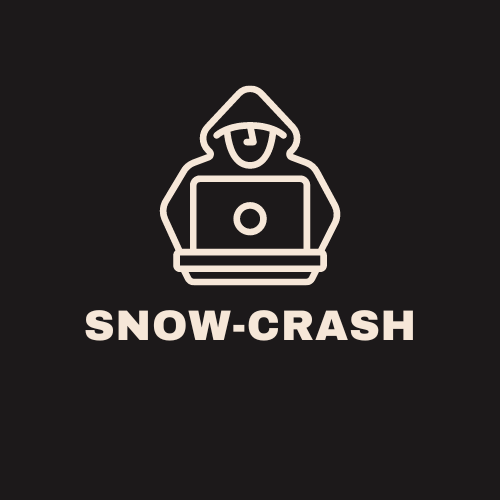

<!-- PROJECT LOGO -->

  

<!-- ABOUT THE PROJECT -->
## About The Project

snow-crash is a 42 project and an introduction to IT security. A system image is given, and the goal is to escalate privileges, with various techniques. All steps are documented in markdown files, feel free to read them.

Full subject is available [here](docs/) and system image file (.iso) [here](https://github.com/kema-dev/snow-crash/releases/tag/iso)

### Built With

* [retdec](https://github.com/avast/retdec)

<!-- CONTACT -->
## Contact

kema-dev - [GitHub](https://github.com/kema-dev)
