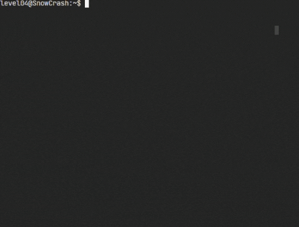

<!-- PROJECT LOGO -->

  

<!-- ABOUT THE PROJECT -->
## About The Project

snow-crash is a 42 project and an introduction to IT security. A system image is given, and the goal is to escalate privileges, with various techniques. All steps are documented in markdown files in [levels folder](/levels), feel free to read them.

## Environment

I did all of this using [Kali](https://www.kali.org/) as host, and [VirtualBox](https://www.virtualbox.org/) as virtualization software to run the ISO. I configured the network as a bridged adapter.

## Some of the techniques used

* **Decompilation / Reverse engineering -> Exploitation**
* Input checking bypass
* Code injection
* File impersonating
* Library injection
* Environnement variables / $PATH trickery
* Reversing deprecated cryptography algorithms

Full subject is available [here](docs/) and system image file (.iso) [here](https://github.com/kema-dev/snow-crash/releases/tag/iso)

### Using

* [retdec](https://github.com/avast/retdec)

<!-- CONTACT -->
## Contact

kema-dev - [GitHub](https://github.com/kema-dev)
